# KoreAi RAG：从“能搜到”到“能稳定答全”的工程演进复盘

> 参考原文格式：[RAG深入学习以及项目落地成果](https://coblog.top/article/rag-shen-ru-xue-xi-yi-ji-xiang-mu-luo-di-cheng-g)

## 这份文档怎么用

这不是一份“我用了哪些技术”的清单，而是一份给自己复盘和面试表达用的工程记录。

它要回答的是：

- 最开始的 RAG 为什么不稳定？
- 每一次问题到底发生在哪一层？
- 为什么不能靠提示词或样本特判修？
- 后来为什么引入 BM25、pgvector、RRF、CE、证据门禁、短期记忆、Trace？
- 哪些测试证明链路变好了？
- 哪些地方仍然不能包装成成果？

一句话主线：

> KoreAi 的 RAG 演进不是“调 topK、换模型、堆 prompt”，而是把一次失败回答拆到解析、切块、候选池、排序、证据组装、生成约束、会话记忆和链路可观测性不同层，确认根因后只在对应层修。

这句话比“我做了 BM25 + Vector + RRF + CE”更重要。后者只是技术名词，前者说明你知道系统为什么会错。

## 当前最终链路

```mermaid
flowchart LR
  Q["用户问题"] --> M["会话短期记忆 / 指代消解"]
  M --> P["Query Planning / 本地路由"]
  P --> B["BM25 / pg_search"]
  P --> V["pgvector / HNSW"]
  P --> S["Reference / Evidence Seed"]
  B --> R1["一级 RRF"]
  V --> R1
  S --> R1
  R1 --> G1{"首轮证据是否足够"}
  G1 -- "足够" --> C["候选池"]
  G1 -- "不足" --> W["query rewrite / supplemental query"]
  W --> Q1["每个 query 独立 BM25 + Vector"]
  Q1 --> R2["query 内一级 RRF"]
  R2 --> R3["跨 query 二级 RRF"]
  R3 --> C
  C --> CE["Gated CE Rerank"]
  CE --> E["Evidence Planning / Assembly"]
  E --> Gate["Evidence Gate"]
  Gate --> Facts["Verified Evidence Facts"]
  Facts --> A["NDJSON over fetch 流式回答"]
  A --> T["Workspace Evidence / Admin Trace 复盘"]
```



面试时可以把它翻译成人话：

> 用户提问后，系统先判断是不是接续上一轮问题。如果是“他的处置代码呢”这种模糊追问，就继承最近引用文档；如果显式切换到新文档，就屏蔽旧记忆。之后本地规则和 LLM 辅助理解共同生成检索计划。检索层用关键词和向量两路召回，弱证据时才触发多 query 的二级 RRF。候选池进入 CE 精排和证据组装，最后按字段槽位判断证据是否足够，并把已验证事实喂给生成模型。

## 1. 最早阶段：能跑通，但不稳定

最早版本是典型最小 RAG：

```text
文档上传
-> 解析文本
-> 切 chunk
-> embedding
-> 向量相似度召回
-> LLM 根据 excerpts 回答
```

这个阶段的价值是打通闭环：文件能进知识库，用户能提问，模型能基于片段回答。

但真实测试后很快暴露问题：

| 问题 | 现象 | 根因 |
|---|---|---|
| 编号类问题不稳 | 问 `PDF-ENE-03`，相邻 `PDF-SEC-03` 或同模板 chunk 也可能上来 | 纯语义相似度看不懂“编号必须完全一致” |
| 多字段问题漏答 | 阈值答了，责任角色或处置代码漏了 | topK 里有目标文档，但最终证据没覆盖全部字段 |
| 图片字段缺失 | 文本说“值在附件图片中”，但具体 `75% / ACT-*` 没被用上 | OCR/视觉解析与证据抽取割裂 |
| 模型看见但不用 | chunk 里有值，答案仍说“未找到” | 生成阶段没有显式事实摘要和槽位约束 |
| 追问污染 | 先问 DOCX，再问 PDF，旧 DOCX 事实进入新 query | 记忆没有按文档/引用范围隔离 |

这说明问题不是“模型不够聪明”，而是 RAG 链路没有把“什么证据足够回答”建模清楚。

## 2. 文档解析：解析质量决定 RAG 上限

RAG 的第一层不是检索，而是解析。如果事实没有被解析出来，后面 BM25、向量、RRF、CE 都救不了。

当前解析链路覆盖：

| 格式 | 当前处理 | 为什么这样做 |
|---|---|---|
| PDF | native parser、MinerU、OCR/VLM fallback | PDF 既可能有可复制文本，也可能是图文混排或扫描页 |
| DOCX | OOXML 段落、表格、列表、embedded image OCR | 企业文档经常把关键字段放在表格或图片附件里 |
| Markdown | heading、段落、列表、表格 | Markdown 天然有结构，适合 section-first 切块 |
| TXT | 段落和标题启发式 | 纯文本结构弱，只能保守识别 |

解析后的统一结构是 `StructuredBlock`。它保留：

| 字段 | 人话解释 | 对 RAG 的影响 |
|---|---|---|
| `type` | 段落、标题、表格、OCR 页、图片 OCR 等块类型 | 决定后续 chunk 怎么组装 |
| `content` | 块里的真实文本 | 是检索和回答的主体 |
| `title` | 当前块标题 | 帮助定位章节 |
| `sectionPath` | 当前块所在章节路径 | 帮助找“哪一节”的规则 |
| `pageNumber` | PDF 页码或来源页 | 支持引用溯源 |
| `bbox` / metadata | 图文解析位置、OCR 来源等 | 支持视觉字段排查 |

最重要的经验：

> “值保存在图片中”不是“值不存在”。如果 MinerU/OCR 已经把图片里的 `ALERT THRESHOLD 75%` 提取成文本，那么 `75%` 就是可用证据，图片只是来源属性。

这条是后来修证据门禁时非常关键的原则。之前失败过的现象是：LLM 思考层已经判断 `75%` 正确，但修复/校验层只看到“保存在图片中”这类描述，反而把真值抹掉。

当前实现位置：

- `apps/server/src/modules/knowledge/pipeline/document-processing/knowledge-document.parser.ts`
- `apps/server/src/modules/knowledge/pipeline/document-processing/knowledge-pdf-parser.service.ts`
- `apps/server/src/modules/knowledge/pipeline/document-processing/knowledge-ocr.service.ts`
- `apps/server/src/modules/knowledge/pipeline/document-processing/knowledge-chunk-builder.ts`
- `apps/server/src/modules/knowledge/pipeline/document-processing/mineru-content-list.parser.ts`

面试表达：

> 我没有把解析当成简单的 text extraction。PDF、DOCX、Markdown、TXT 会先统一成结构化 block，保留标题、章节、页码、表格和 OCR 来源。这样后面检索的不只是正文，还能追溯证据来自哪一页、哪一节、是不是视觉附件。

## 3. Chunk：不是越多越好，也不是越长越好

早期容易犯的错误是按固定字符数切块，或者只看 chunk 数量判断好坏。

真实问题是：

- chunk 太短：一个问题需要的阈值、角色、处置代码被切散。
- chunk 太长：相邻规则混在一起，模型容易拿错字段。
- 标题重复塞入正文：embedding 被文档名/路径污染，正文事实被稀释。
- PDF 跨页合并过度：页级来源和视觉附件关系变得模糊。

当前策略可以概括为：

```text
section-first
-> target-sized packing
-> length fallback
-> controlled overlap
-> preserve page/source metadata
```

关键取舍：

| 设计 | 目的 |
|---|---|
| section-first | 优先保证自然章节完整 |
| target-sized packing | 小段落可以合并到合理大小，避免碎片化 |
| maxChars fallback | 超长块必须切开，避免一个 chunk 塞太多主题 |
| overlap 不跨 PDF 页 | 防止页级证据和来源错乱 |
| content 只保留 section title + body | 文档根标题不重复污染 embedding |
| documentName / primaryTitle / sectionPath 独立入 searchable fields | 精确检索和语义检索分工 |

面试表达：

> Chunk 不是只按字符数切。我更关注“一个回答所需事实是否能在少量 chunk 内完整出现”。所以我把正文和元数据分开：正文服务 embedding，文档名和章节路径服务精确检索、过滤和溯源。

## 4. 增量索引与文档生命周期

文档重建不能直接覆盖线上 chunk，否则重建失败会污染可用索引。

当前机制：

```text
文件 SHA256 判断源文件变化
-> 解析并生成新 chunk 草稿
-> chunk 复合指纹判断 embedding 是否可复用
-> 构建新 revision
-> 成功后原子切换 activeRevisionId
-> 旧 revision 延时清理或回滚
```

关键点：

| 机制 | 解决什么问题 |
|---|---|
| 文件指纹 | 判断文档是否真的变了 |
| chunk 复合指纹 | 未变片段复用 embedding，减少重建成本 |
| revision 原子切换 | 新索引没建完前不影响线上检索 |
| active revision 过滤 | 检索永远只读当前有效版本 |
| BullMQ rebuild queue | 重建异步化，避免 HTTP 长时间阻塞 |
| cleanup queue | 过期 inactive revision 延时清理 |

面试表达：

> 我把文档索引做成 revision 版本，而不是重建时直接覆盖旧 chunk。新 revision 完整构建成功后才切换 activeRevisionId，失败不会污染线上检索结果。

## 5. Query Planning：LLM 理解问题，本地代码做决策

这里是 RAG 稳定性的核心之一。

原则：

> LLM 可以辅助理解 query，但不能直接决定检索权重和最终路由。

原因很简单：LLM 可能误判。如果用户问 `PDF-SEC-03`，模型把它当成普通语义问题，向量权重过高，相邻模板文档就可能上来。编号、字段、数值这些硬约束必须由本地确定性规则保护。

后续我把旧的“一个 routeType 管所有问题”收敛掉了。原因是 RAG 的一次执行不是单一类型能描述的：同一个问题可能既是显式文档范围，又是多字段抽取，还需要混合召回和结构化回答。如果继续新增 `pdf_visual_exact`、`memory_followup_field`、`multi_doc_summary` 这类枚举，状态机会越来越像补丁墙。

当前更准确的表达是执行画像：

| 维度 | 当前观测字段 | 它回答的问题 | 典型值 |
|---|---|---|---|
| 用户意图 | `ragUserIntent` | 用户是在问精确字段、流程、开放总结，还是普通聊天 | `precise`、`procedure`、`comparison`、`general_question` |
| 范围模式 | `ragScopeMode` | 这次回答应该绑定哪些文档或知识库范围 | `unscoped`、`explicit_scope`、`memory_scope`、`needs_clarification` |
| 检索模式 | `ragRetrievalMode` | 候选池怎么召回 | `bm25`、`vector`、`hybrid` |
| 回答模式 | `ragAnswerMode` | 最终应该 RAG、拒答、澄清还是通用回答 | `rag`、`refuse`、`clarify`、`general` |
| 范围覆盖 | `scopeCoverage` | 用户点名的对象是否都进入最终证据 | `PDF-ENE-01`、`PDF-SEC-01` 是否都覆盖 |
| 事实覆盖 | `factCoverage` | 问题要求的字段或事实是否有具体证据 | 阈值、责任人、处置代码是否都有值 |

这个拆法的好处是：每个维度只管自己的事。

| 旧做法 | 问题 | 现在的做法 |
|---|---|---|
| 一个 `routeType` 同时表达范围、意图、检索策略和回答策略 | 枚举爆炸，边界样本越修越乱 | 拆成 profile 维度，分别记录、分别调试 |
| 用问题类型决定所有 downstream 行为 | 一个误判会污染整条链路 | 本地规则、LLM 理解、证据门禁各自有边界 |
| 用 coverage 一个数表示“证据够” | 多文档覆盖和字段值覆盖混在一起 | `scopeCoverage` 和 `factCoverage` 分开看 |
| 为每个失败样本新增 type | 变成数据集特判 | 只扩展稳定维度或证据 slot |

高频调试字段解释：

| 字段 | 它是什么 | 影响哪里 | 例子 |
|---|---|---|---|
| `evidenceTerms` | 用来判断证据是否够的可验证词 | Evidence gate、补 chunk、事实摘要 | “版本归档”“旧值”“审核人” |
| `evidenceFieldSlots` | 用户要求的结构化字段槽位 | 证据覆盖、确定性 QA、补证据 | `main_control_threshold`、`action_code` |
| `evidenceNumericTerms` | 数字、日期、金额、比例 | 多事实覆盖和事实抽取 | `75%`、`3 秒` |
| `retrievalScopeObjects` | 本轮必须覆盖的文档、记录或对象 | scope gate、引用约束 | `PDF-ENE-03`、`cache_breakdown.md` |
| `secondLevelRrfQueries` | 弱证据时追加的多个 query 域 | 二层 RRF 候选池 | 原问、改写问、BM25 子域、Vector 子域 |
| `gateStatus` | 证据门禁结果 | 决定回答、拒答或降级 | `passed`、`degraded`、`blocked` |

面试里不要说“我设计了一个很复杂的 type 状态机”。更稳的说法是：

> 我一开始也尝试过用单个 routeType 描述问题类型，但它会把意图、范围、检索策略和回答策略绑死，后面边界样本越多越难维护。后来我把运行状态拆成 execution profile：用户意图、范围模式、检索模式、回答模式，再单独记录 scopeCoverage 和 factCoverage。这样多文档比较题先看对象是否覆盖，字段抽取题再看 slot 是否有值，通用问题也不会被错误塞进知识库拒答。

当前实现位置：

- `apps/server/src/modules/knowledge/pipeline/query-understanding/knowledge-query.service.ts`
- `apps/server/src/modules/knowledge/pipeline/query-understanding/knowledge-query-engine.service.ts`
- `apps/server/src/modules/knowledge/pipeline/query-understanding/knowledge-query-rule-router.ts`
- `apps/server/src/modules/knowledge/pipeline/query-understanding/knowledge-query-analysis.service.ts`
- `apps/server/src/modules/knowledge/pipeline/query-understanding/knowledge-query-plan.types.ts`

## 6. BM25、pgvector 与一级 RRF

RAG 不能只靠向量。

企业知识库里很多事实是字面敏感的：

- 文档编号：`PDF-ENE-03`
- 处置代码：`ACT-PENE-23`
- 角色：`operations_director`
- 字段名：`ALERT THRESHOLD`
- 版本号、错误码、流程编号

向量检索擅长理解“意思相近”，但不擅长保证编号完全一致。BM25 擅长精确词面，但白话问题可能召不全。所以当前是混合召回：

| 分支 | 作用 |
|---|---|
| BM25 / pg_search | 找编号、字段名、文件名、原词、代码 |
| pgvector / HNSW | 找语义相近表达 |
| Reference Seed | 找标准、规范、支撑材料 |
| RRF | 按名次融合多路候选，避免不同分数体系不可比 |

一级 RRF 做的是：

```text
同一个 query 内：
BM25 排名 + Vector 排名 + reference/evidence seed
-> RRF 融合为一个候选池
```

注意：RRF 不是为了让分数“看起来高级”，而是避免 BM25 分数和向量距离强行相加。它用排名融合，更稳。

当前实现位置：

- `apps/server/src/modules/knowledge/pipeline/candidate-retrieval/knowledge-bm25.service.ts`
- `apps/server/src/modules/knowledge/pipeline/candidate-retrieval/knowledge-vector-store.service.ts`
- `apps/server/src/modules/knowledge/pipeline/candidate-retrieval/knowledge-hybrid-ranker.ts`
- `apps/server/src/modules/knowledge/pipeline/candidate-retrieval/knowledge-retrieval.service.ts`

面试表达：

> BM25 解决硬词面，向量解决语义差异，RRF 解决不同召回分支分数不可比的问题。它不是为了堆算法，而是让编号类和白话类问题都能进候选池。

## 7. 后续新增：条件触发的二级 RRF

二层 RRF 是后续很关键的一次改造，但不能讲成“无脑两层 RRF”。

正确说法：

> 在弱证据场景下引入二级 RRF 补召回：每个 rewrite query 独立执行 BM25 与向量召回，并先在 query 内完成一级 RRF；随后将多个 query 的一级候选再次进行 RRF 融合，形成更稳定的候选池，再交给 CE 重排与证据门禁筛选。

完整流程：

```text
原 query 首轮检索
-> evidence weak / coverage 低 / protected terms 未覆盖
-> 生成多个 rewrite 或 supplemental query
-> 每个 query 独立跑 BM25 + Vector
-> 每个 query 内部一级 RRF
-> 多个 query 的一级候选跨 query 二级 RRF
-> 候选池进入 CE / Evidence Gate
```

为什么不能直接把多个 rewrite 拼成一个大 query？

| 做法 | 问题 |
|---|---|
| 拼成一个大 query | 关键词权重被稀释，BM25 不知道哪些词最重要 |
| 每个 query 独立召回 | 保留不同表达视角，白话、术语、英文字段都能单独发力 |
| 跨 query 二级 RRF | 多个 query 都命中的 chunk 会自然上升 |

适合触发：

- 第一轮 evidence coverage 低。
- BM25 命中少或最高分低。
- protected terms 没覆盖。
- 多事实问题缺少部分事实。
- 白话 query 找不到专业术语。

不适合触发：

- 精确编号第一轮已经命中。
- 单事实问题证据覆盖够。
- 低延迟场景。
- 已经有明确文档 ID 且前排稳定。

真实调试里出现过的例子：

| 问法 | 旧链路问题 | 二层 RRF 后的方向 |
|---|---|---|
| “能不能只让一个请求去查数据库，其他请求先等着？” | 白话问题容易被普通“数据库并发”材料稀释，query analysis 耗时高 | rewrite 到“Redis 缓存击穿 / 互斥锁 / 等待重试”，多 query 融合后能命中 `cache_breakdown.md` |
| “附件仪表盘中的预警值呢” | 中文问法和英文 OCR 字段 `ALERT THRESHOLD` 不完全一致 | query domain 保留“附件/仪表盘/alert threshold/dashboard”多视角 |
| “处置代码是？” | 依赖上一轮上下文，原 query 太短 | 先由 scoped memory 补文档，再按 `ACTION CODE` 扩召回 |

测试前后的主要变化：

- 早期只看单 query，弱证据时常出现“目标文档在候选池外”。
- 引入二级 RRF 后，弱证据 fallback 能把 rewrite 视角里的候选重新拉进最终候选池。
- 后续 30 样本 memory retrieval 回归中，expected document hit 达到 `30/30`，local memory follow-up 为 `6/6`。
- 单个 blocked case 是 active chunk 本身缺失事实，不属于召回修复目标。

面试表达：

> 我做的二层 RRF 是条件触发的，不是全量加重链路。首轮证据足够时不触发；只有弱证据时，才把多个改写 query 分别召回，再跨 query 融合。这样能提升白话和模糊问题的候选覆盖，同时避免精确编号问题被过召回污染。

## 8. CE Rerank：它是边界，不是召回替代品

CE 容易被误讲成“接了一个重排模型，所以更准”。这个说法不够严谨。

CE 的边界：

| 能做 | 不能做 |
|---|---|
| 在候选池内部判断哪条更相关 | 找回候选池外不存在的 chunk |
| 处理语义相近但词面不同的候选排序 | 修复解析缺失 |
| 压掉低相关候选 | 替代精确 ID 保护和编号冲突处理 |

当前原则：

- CE 只在复杂问题或高约束问题 gated 触发。
- CE 最多处理有限候选窗口。
- CE 结果不仅是排序信号，也是 relevance boundary。
- 最终 evidence 不为了凑满 topK 强留低相关 chunk。
- CE 失败时回退到确定性排序，不允许半批评分污染结果。

测试中暴露过一个问题：CE 后如果仍然强行保留 topK，低相关 chunk 还是会混进最终 evidence。后续修正为：CE 最佳分的相对阈值以下候选不再为了凑数量保留。

面试表达：

> CE 只能重排候选池已有内容，所以我先保证召回阶段目标文档进池，再让 CE 做精排。它是 relevance boundary，不是召回替代品。

## 9. Evidence Gate：从关键词覆盖到 slot 级事实覆盖

这是后续最关键的一类修复。

旧问题：

```text
用户问：PDF-ENE-03 的主控制阈值和责任角色是什么？附件仪表盘中的预警值与处置代码分别是什么？

证据里有 ALERT THRESHOLD 75%
系统 coverage 显示 100%
但答案把主控制阈值错答成 75%，责任角色说没找到
```

根因：

- `threshold` 这个词同时出现在“主控制阈值”和“附件预警阈值”里。
- 旧 coverage 按词覆盖，容易把 `ALERT THRESHOLD` 当成 `main_control_threshold` 的证据。
- 但业务上这是两个不同字段。

当前改法：按 slot 识别事实。

| slot | 中文问法 | 英文/OCR 字段 | 合格证据 |
|---|---|---|---|
| `main_control_threshold` | 主控制阈值、主阈值、管控线 | main control threshold、control threshold | 字段附近有具体百分比 |
| `alert_threshold` | 预警值、预警线、附件仪表盘预警值 | ALERT THRESHOLD、visual alert | 仪表盘/附件字段附近有具体百分比 |
| `responsible_role` | 责任角色、负责人、归谁确认 | owner、role、responsible | 字段附近有角色值 |
| `action_code` | 处置代码、动作码 | ACTION CODE、execute act | 字段附近有 `ACT-*` 或明确代码 |
| `response_time` | 响应时限、多久内处理 | ESCALATION WINDOW、response time | 字段附近有时间值 |

核心规则：

- retrieval alias 可以扩召回。
- 但 alias 不能直接算硬证据覆盖。
- 只有字段附近有具体值，slot 才算覆盖。
- “值存于图片”是来源说明，不是否定值。
- 主控制阈值和附件预警值不能互相覆盖。

面试表达：

> 我把 evidence coverage 从“词有没有出现”升级成“问题要求的字段槽位有没有具体值支撑”。比如主控制阈值和附件预警值都可能叫 threshold，但它们是不同 slot，不能互相替代。

## 10. Verified Evidence Facts：解决“chunk 对了但答案漏字段”

即使正确 chunk 进入上下文，LLM 仍可能漏用。

典型现象：

- 思考层判断出 `ACT-PSEC-23`。
- 最终答案却说“未找到处置代码”。
- 或者多字段问题只答了其中两项。

因此生成前会抽取 `Verified Evidence Facts`：

```text
最终 evidence hits
-> 按 query/debug 信号匹配事实句
-> 提取关键数字、角色、代码、时限
-> 控制数量和长度
-> 注入 QA prompt
```

它不是第二套知识库，也不是模型自己编的 facts。它只能来自最终命中的 chunk。

实现位置：

- `apps/server/src/modules/knowledge/pipeline/evidence-gating/knowledge-evidence-fact-extractor.ts`
- `apps/server/src/modules/knowledge/pipeline/answer-generation/knowledge-qa.prompts.ts`
- `apps/server/src/modules/knowledge/pipeline/answer-generation/knowledge-qa.service.ts`

面试表达：

> RAG 不只会在检索阶段失败，也会在生成阶段漏用事实。我在 QA 前从最终证据中确定性抽取关键 facts，把数字、角色、处置代码显式提供给模型，降低“证据在上下文里但答案没用上”的概率。

## 11. 会话短期记忆：不是把历史无脑拼到 query 后面

多轮问答里最容易出错的是“该继承时没继承，不该继承时污染”。

目标行为：

| 场景 | 正确行为 |
|---|---|
| 同会话先问 `DOCX-ENE-02`，再问“他的处置代码呢” | 允许继承上一轮文档 |
| 同会话问完 DOCX，再显式问 `PDF-ENE-03` | 不把 DOCX 事实拼进 PDF query |
| 新会话直接问 `PDF-ENE-03` | 不依赖旧会话记忆，仍要稳定召回 |
| 问“王者荣耀是什么” | 可走通用知识，不应被知识库弱证据拒答 |
| 问“能不能只让一个请求查数据库，其他等着” | 如果历史/知识库有 cache_breakdown 事实，记忆可提供 retrieval hints，但仍要 fresh RAG |

当前 memory board 记录：

| 字段 | 作用 |
|---|---|
| `goal` | 当前用户目标 |
| `currentTopic` | 当前主题 |
| `referencedObjects` | 引用过的文档 ID、文件名、代码、角色、章节 |
| `confirmedFacts` | 已确认答案事实 |
| `retrievalHints` | 可帮助下一轮检索的词 |
| `openTodos` | 未完成事项 |

关键原则：

- 显式结构化 ID 优先匹配同 ID 记忆。
- 模糊追问继承最近 assistant citation。
- 新目标屏蔽无关历史事实。
- 强本地记忆命中可跳过 memory LLM，但不能跳过 RAG 证据。
- 通用问题可绕过知识库，但要说明不是基于 KB。

后来发现过的真实 bug：

> 模糊追问时，旧实现可能把多个历史文档 entry 合并到同一个 memory board，导致前端摘要看到旧 DOCX 污染。修法不是写死某个 PDF，而是让 memory key 优先使用带数字的结构化 ID，并且 follow-up 取最近引用。

测试结果：

- `scripts/final_eval/run_memory_retrieval_30.js`
- `scripts/final_eval/run_memory_qa_30.js`
- 30 个 PDF/DOCX/MD/TXT 样本
- expected document hit `30/30`
- local memory follow-up `6/6`
- gate `24 pass / 5 degraded / 1 blocked`
- blocked case 是 active chunks 缺事实，拒答正确

实现位置：

- `apps/server/src/modules/workspace/chat/workspace-chat-memory.service.ts`
- `apps/server/src/modules/workspace/chat/workspace-chat.service.ts`
- `apps/server/src/test/workspace/chat/workspace-chat-memory.service.test.ts`

面试表达：

> 我没有把历史对话直接拼到 query 后面，而是做 scoped memory。显式新文档只匹配同文档记忆，模糊追问才继承最近 citation。这样既能解决“他的处置代码呢”，也能避免旧 DOCX 事实污染新 PDF 问题。

## 12. 通用知识回答：证据不足不等于永远拒答

早期系统过于严格：只要知识库证据不足，就拒答。

这对企业制度问答是安全的，但对普通问题体验很差。

例子：

- “你好”
- “王者荣耀是什么”
- “返回一下 Redis 的有关问题，我是新手”
- “无畏契约是”

这些不一定应该进 RAG。当前策略是：

| 问题类型 | 行为 |
|---|---|
| 明确文档 ID、文件名、知识库范围 | 走 RAG |
| 模糊追问但有最近 citation | 记忆消解后走 RAG |
| 普通开放问题 | 可绕过 RAG，走通用回答 |
| 知识库证据弱但用户问的是项目内事实 | 保守回答或拒答 |

这里的边界是：通用知识不能伪装成知识库证据。

面试表达：

> 我把“知识库问答”和“普通聊天/开放知识”分开。企业文档事实必须绑定证据；普通开放问题如果没有知识库证据，可以走通用回答，但会明确不是基于当前知识库。

## 13. Trace 可视化：让每次失败能复盘

如果只看最终答案，很难知道问题发生在哪一层。

后来 Trace 页面要展示：

| 信息 | 用途 |
|---|---|
| originalQuery / normalizedQuery | 用户原问题和归一化结果 |
| memoryIntent / memoryBoard / retrievalHints | 记忆是否介入，是否污染 |
| ragUserIntent / ragScopeMode | 用户意图和检索范围是否正确 |
| ragRetrievalMode / ragAnswerMode | 本轮是混合检索、RAG 回答、拒答还是澄清 |
| bm25Query / vectorQuery | 两路实际检索词 |
| bm25HitCount / vectorHitCount | 哪一路命中弱 |
| secondLevelRrfApplied / Queries | 二层 RRF 是否触发，用了哪些 query 域 |
| ceCandidateCount / ceLatency | CE 是否跑了 |
| evidenceTerms / evidenceFieldSlots / gateStatus | 证据为什么 pass/degraded/blocked |
| scopeCoverage / factCoverage | 点名对象和事实字段是否分别覆盖 |
| citations | 最终到底引用了哪些 chunk |
| persisted JSON | 历史消息的不可变快照 |

重要原则：

- Trace 不是新建一套 trace 表。
- assistant message 持久化 `citations` 和 `retrievalDebug`。
- Workspace 证据抽屉和 Admin Trace 看到同一份运行快照。
- 历史 trace 是不可变快照，算法更新后不改写旧 trace。

实现位置：

- `apps/client/src/views/admin/traces/index.vue`
- `apps/server/src/modules/workspace/entity/workspace-message.entity.ts`
- `apps/share-type/knowledge.ts`
- `apps/share-type/workspace.ts`

面试表达：

> 我把 citations 和 retrievalDebug 跟 assistant message 一起持久化，所以每次回答都能复盘：记忆有没有介入、scope 是否覆盖、二层 RRF 有没有触发、CE 有没有跑、证据门禁为什么 pass、degraded 或 blocked。

## 14. 流式输出：当前不是 SSE，是 NDJSON over fetch

当前 Workspace 流式输出不是标准 SSE，而是 NDJSON streaming。

实际链路：

| 项 | 当前实现 |
|---|---|
| 请求 | `POST /api/workspace/chat/stream` |
| 响应类型 | `application/x-ndjson; charset=utf-8` |
| 前端读取 | `fetch()` + `response.body.getReader()` |
| 事件形式 | 每行一个 JSON |
| 事件类型 | `thinking_delta`、`answer_delta`、`completed`、`error` |
| 中断 | `AbortController` |

为什么不上标准 SSE？

- 标准 `EventSource` 天然是 GET。
- 当前聊天需要 POST JSON body，包含 conversation、knowledgeBase、think、rewrite 等参数。
- NDJSON 可以在一个请求里完成“提交问题 + 接收结构化流”。
- 对当前单次问答链路更直接。

面试表达：

> 这个项目当前不是标准 SSE，而是 NDJSON over fetch。原因是聊天请求需要 POST JSON body，并且要支持 AbortController 中断和结构化事件。SSE 更适合 GET 订阅型推送，当前问答链路用 fetch reader 更贴合。

## 15. 评估：不要只报 RAGAS 分数

评估必须分层，否则会误判。

当前评估口径：

| 层 | 看什么 | 说明 |
|---|---|---|
| Retrieval Gate | gold document、top1、required terms、multi-fact、irrelevant chunk | 低成本定位召回和证据问题 |
| RAGAS | faithfulness、context recall、answer correctness 等 | 参考指标，不等于真实正确率 |
| 人工硬事实核对 | 数字、阈值、角色、代码、时限是否完整 | 最接近业务风险 |
| Trace 回放 | 失败样本发生在哪一层 | 防止盲目调 prompt |

已记录的测试结果：

| 时间/样本 | 结果 | 怎么解释 |
|---|---|---|
| 早期业务问答 | 正确率约 70% | 说明最小 RAG 能跑但不稳定 |
| 主测试集 | 真实业务正确率 97%+，目标文档召回 99%+，关键事实覆盖约 99%~100% | 说明结构化检索和证据链路显著改善 |
| 10 领域、60 篇中文长文档、180 道硬事实问题 | 目标文档、关键术语、答案硬事实完整通过 | 说明多领域硬事实稳定性增强 |
| 2026-07-18 mixed-format run | 121/121 无请求错误，Recall@5 / Top-1 / MRR / final-source gold-document recall 为 `1.0` | 召回层强，但答案质量还不能包装成全通过 |
| 同轮 mixed-format | answer hard-fact coverage `0.8285`，fully complete `0.6033` | 暴露 final evidence selection 和 DOCX 图片字段仍是瓶颈 |
| 2026-07-22 memory regression | expected document hit `30/30`，local memory follow-up `6/6` | scoped memory 对追问稳定有效 |

不能误讲：

- 不能把 RAGAS `answer_correctness` 直接说成真实正确率。
- 不能把 DOCX 图片 OCR 未完全解决包装成“全格式 100%”。
- 不能只报 Recall@5，因为正确文档进来了，不代表答案字段完整。
- 不能用低分样本人工改分替代问题修复。

面试表达：

> 我没有只报一个 RAGAS 分数，而是先看目标文档是否召回，再看答案所需硬事实是否进入最终 evidence，最后逐项核对答案里的数字、角色、阈值和代码。这样能区分是检索失败、证据组装失败，还是生成阶段漏用事实。

## 16. 架构 type 收敛：不要为每个 bug 新增一种类型

RAG 项目最容易越修越乱的地方，就是把每个失败 case 都变成一个新 type。

例如：

- PDF 视觉字段漏了，就想加 `pdf_visual_field`。
- 多文档共性题不稳，就想加 `multi_doc_commonality`。
- 三级预警值误答，就想加 `level_3_alert_threshold`。
- 归档模式证据门禁拦了，就想加 `archive_summary`。

这些名字看起来都合理，但如果它们直接变成主路由类型，系统很快会失控。因为它们混合了不同层的问题：

| 失败现象 | 真正归属层 | 不应该怎么修 |
|---|---|---|
| 点名三个文档，只答了两个 | scope coverage | 不应该新增一个“三文档题”路由 |
| `三级预警值` 被普通 `预警值` 满足 | field slot | 不应该写死三级样本 |
| 归档模式明明有事实却被拒答 | evidence term expansion | 不应该让 LLM 无条件放行 |
| 文档召回到了但答案漏字段 | final evidence / deterministic QA | 不应该单纯调 prompt |
| 语义分块后 chunk 更多但答案没提升 | chunk granularity | 不应该强行保留新策略 |

所以当前架构 type 的核心不是“枚举更多问题类型”，而是把链路拆成稳定维度。

```text
用户问题
-> ragUserIntent：用户到底想问什么
-> ragScopeMode：应该绑定哪些文档或对象
-> ragRetrievalMode：用什么召回方式
-> ragAnswerMode：回答、拒答、澄清还是通用知识
-> scopeCoverage：对象是否覆盖
-> factCoverage：事实是否覆盖
```

这套结构的工程价值：

| 价值 | 解释 |
|---|---|
| 易排查 | 一眼能看出失败发生在范围、召回、证据还是生成 |
| 少特判 | 新问题优先落到已有维度，不急着新增路由 |
| 可对比 | A/B 测试可以按模块开关，而不是改一堆隐式分支 |
| 可面试 | 能讲清楚“为什么这么拆”，而不是只背技术名词 |

面试表达：

> 我最后没有继续扩展一个巨大的 routeType 枚举，而是把 RAG 运行态拆成正交 profile。比如多文档比较题主要看 scopeCoverage，字段抽取题主要看 factCoverage，普通开放问题看 answerMode 是否允许 general。这样每次失败能定位到具体层，而不是为每个失败样本再加一个新类型。

## 17. 字段 slot：精确字段问题必须比普通语义问题更严格

字段 QA 的关键不是“能不能搜到 threshold”，而是“用户问的是哪个 threshold”。

当前稳定 slot：

| slot | 覆盖的问题 | 合格证据 |
|---|---|---|
| `main_control_threshold` | 主控制阈值、主控阈值、主阈值 | 当前文档字段附近出现百分比 |
| `alert_threshold` | 普通预警值、附件仪表盘预警值 | 预警/告警字段附近出现百分比 |
| `alert_threshold_level_N` | 一级、二级、三级、六级等明确级别预警值 | 同级别标签附近出现百分比 |
| `responsible_role` | 责任角色、负责人、责任人 | 角色字段附近出现明确角色值 |
| `action_code` | 处置代码、动作代码、执行编号 | 字段附近出现 `ACT-*` |
| `response_time` | 响应时限、升级窗口、多久内处理 | 字段附近出现小时、分钟、天等时间值 |

这次“三级预警值”的修复原则：

- `三级预警值` 不能被普通 `预警值：78%` 满足。
- `三级预警值` 不能被 `一级预警值`、`二级预警值` 满足。
- `3级预警值`、`三级预警值`、`level 3 alert` 是同一个稳定语义。
- `六级拦截`、`八级标志` 不是预警值 slot，不能硬塞进 deterministic QA。
- 混合问题不能走字段快路径，例如“三级预警值是多少，同时描述归档模式”必须交给 LLM 基于证据组织完整答案。

这个设计看起来比正则多写几条麻烦，但它避免了两个更大的坑：

| 坑 | 后果 |
|---|---|
| 所有预警都归到一个 `alert_threshold` | 级别问题会被错误值满足，factCoverage 虚高 |
| 所有“几级什么”都做成动态字段 | `六级拦截`、`八级标志` 这类开放表达会误伤 |

面试表达：

> 我没有把所有 threshold 都粗暴归成一个字段。主控制阈值、附件预警值和级别预警值是不同 slot；级别预警值支持中文数字、阿拉伯数字和英文 level 表达，但只限于预警/告警字段内。其他“几级拦截、几级标志”不进入确定性 QA，避免正则越修越乱。

## 18. 分块 A/B：语义+结构不是这轮正确率提升的主因

分块是 RAG 的上游基建，但这次测试结论必须诚实。

我尝试过把当前结构化分块升级成“结构 + 严格 embedding 语义分块”：

```text
结构化 block
-> 标题、表格、列表、图片 OCR 保留结构边界
-> 正文内部尝试语义切分
-> 长度兜底和 overlap
-> rebuild 后同一套问题 A/B
```

理论上它合理，因为结构边界保护表格和 OCR，语义切分避免长正文主题混杂。但在当前项目这批 30 题和 100 文档专项集上，实际收益不明显，甚至会让 chunk 变得更细、噪声候选更多。

已验证的关键结果：

| 实验 | 结论 |
|---|---|
| 100 文档、101 中文问题专项 A/B | A/B Pass 都是 `67/101`，说明低 pass 主要不是分块造成 |
| B 语义+结构 | chunk 数变多，但 answerCoverage 没有明显提升 |
| 回退到结构化分块后 30 题重测 | A/B 都达到 `30/30`，说明当前结构分块足够支撑这批硬事实 |
| 低分复盘 | 主要问题集中在拒答口径、归档模式证据门禁、字段绑定和 final evidence |

所以不能这样讲：

> 我引入语义+结构分块后，RAG 准确率显著提升。

更准确的讲法是：

> 我做过结构分块和语义+结构分块的 A/B。结果发现当前召回层已经很强，语义分块没有带来稳定正确率提升，反而可能增加碎片化候选。因此我没有强行上线，而是回退到更稳定的结构化分块，把优化重心转到证据门禁、字段 slot 和 final evidence 组织。

这个结论反而更像真实工程：不是所有“理论更先进”的方案都应该上线，必须看它是否解决当前瓶颈。

## 19. 为什么这轮正确率变高

这轮正确率升高，不是因为“语义分块突然变强”，也不是单纯靠模型思考更久，而是几个稳定机制同时收敛：

| 机制 | 解决的问题 | 用户能看到的变化 |
|---|---|---|
| 结构化分块回退 | 避免语义分块把短事实切得过碎 | 候选更干净，chunk review 更容易 |
| 字段 slot 收敛 | 避免普通预警值冒充三级预警值 | `三级预警值` 没证据时不乱答 |
| 混合问题禁用 deterministic 快路径 | 避免只答第一个字段、漏掉第二个开放问题 | “A 是什么，同时描述 B”能完整走 LLM |
| 归档模式证据扩展 | 把抽象问法映射到可验证事实 | `通用归档模式` 能匹配 `旧值/新值/审核人/记录编号` |
| Evidence Gate 降级边界 | 有部分证据时不一刀切拒答 | 开放总结题更少误拒 |
| final evidence 和 hard fact 验证 | 区分召回成功、证据成功、答案成功 | 测评能解释“为什么错” |

换句话说，正确率高的根因是链路从“搜到一些相关文本”变成了“知道本题需要哪些对象和哪些事实”。

面试表达：

> 这轮提升不是靠单一模块。粗召回指标已经接近满分，继续调 topK 或强推语义分块意义不大。我主要收敛了证据层：字段 slot 更精确，级别预警值不能被普通预警值满足；混合字段和开放问题不再走确定性快路径；归档模式这类抽象问法会扩展成旧值、新值、审核人、记录编号等可验证事实。最终正确率提升来自证据约束变准，而不是候选池盲目变大。

## 20. 当前边界

当前不能包装过头的地方：

1. DOCX embedded image OCR 仍可能漏读或误读部分 `ACT-*` 机器码。
2. CE 增加延迟，只适合 gated 使用，不适合所有 query 全量启用。
3. Memory 只能辅助召回和指代消解，不能替代当前 RAG 证据。
4. 二层 RRF 只解决弱证据候选覆盖，不解决解析缺失。
5. RAGAS 分数只是诊断工具，不是线上真实正确率。
6. 历史 Trace 是不可变快照，不能被新算法“修正”。
7. 语义+结构分块已经做过实验，但当前不能包装成有效提升，只能说“被验证后回退”。
8. 30 题或 101 题专项集能说明链路方向，不能证明统计显著性；面试时必须承认样本规模边界。

## 21. 面试高频追问

### Q1：为什么不用纯向量检索？

因为企业文档里很多问题是编号、字段名、错误码和百分比，这些对字面匹配非常敏感。向量适合理解语义相近，但不保证 `PDF-ENE-03` 和 `PDF-SEC-03` 的边界。BM25 负责硬词面，向量负责语义扩展。

### Q2：为什么不让 LLM 直接决定 BM25/Vector 权重？

权重是检索执行策略，需要可复现和可审计。LLM 可以提供意图、术语、实体，但最终检索模式和回答模式要由本地规则收敛，避免一次误判影响整条链路。

### Q3：二层 RRF 是不是过度设计？

不是全量触发。它只在弱证据 fallback 场景使用，解决单个 query 表达不充分导致候选池漏正确文档的问题。精确编号首轮已经命中时不会触发，避免污染。

### Q4：CE 为什么不能解决所有问题？

CE 只能重排候选池已有内容。如果正确 chunk 没进候选池，CE 看不到它。所以 CE 前必须先保证 BM25/vector/reference seed/RRF 的候选覆盖。

### Q5：Evidence Gate 和 Verified Facts 有什么区别？

Evidence Gate 判断“证据够不够回答”。Verified Facts 是在证据够的情况下，把关键事实显式抽出来喂给生成模型，降低模型漏答。

### Q6：短期记忆怎么避免污染？

记忆不是全量拼历史，而是 scoped memory。显式 ID 只匹配同 ID 历史；模糊追问继承最近 citation；新目标屏蔽旧事实；普通开放问题可绕过 RAG。

### Q7：为什么不是 SSE？

当前聊天是 POST 请求，需要 JSON body 和 AbortController。标准 SSE 的 `EventSource` 更适合 GET 订阅。这里用 NDJSON over fetch 更适合单次问答生成链路。

### Q8：你这个 A/B 样本这么少，凭什么说有效？

不能说统计学显著。更准确的回答是：这套 A/B 是工程冒烟和回归集，不是论文级显著性实验。它的价值是固定同一批文档、同一批问题、同一套评分口径，观察模块开关后失败类型是否变化。真正结论只限于这批场景：召回层稳定，主要瓶颈在证据组织和答案约束。

### Q9：为什么语义+结构分块没上线？

因为 A/B 没证明它提升当前瓶颈。它让 chunk 数变多，但正确率没有稳定上涨，chunk review 还更碎。工程上不能因为方案听起来先进就上线，所以我回退到结构化分块，把精力放在 Evidence Gate、slot 和 final evidence。

### Q10：三级预警值为什么不能直接正则特判？

可以用规则识别，但不能写死三级。正确做法是抽象成 `alert_threshold_level_N`，支持中文数字、阿拉伯数字和英文 level 表达，同时限制在预警/告警字段内。这样问四级、六级预警值也能处理，但问“六级拦截”不会误进字段快路径。

### Q11：为什么有时思考模式比非思考模式更稳？

思考模式通常会更完整地阅读证据和解释子问题，尤其是多文档比较、开放总结、混合字段问题。非思考模式适合纯字段快答，但开放问题更容易漏解释。因此正式评测要固定运行模式，否则同一问题会因为推理预算不同出现不可比结果。

### Q12：如果面试官问 RRF 提升了多少，怎么回答？

不要只报一个大数字。可以说：在标准消融里，A0 到 Hybrid/RRF 的主要收益体现在 Recall@5 和 gold source hit 更稳定，但 Pass 不一定同步上涨，因为后续瓶颈转移到了证据门禁和生成。RRF 解决的是“正确候选进池”，不是“最终答案一定完整”。

### Q13：为什么最终正确率高，不是测试集被你针对性优化了吗？

要承认风险，但说明你怎么降低风险：同一批问题固定复跑、失败样本重复三次以内验证波动、看 retrieval 和 answer 分层指标，而不是只看最终 pass。更关键的是代码修复要落在通用机制上，例如 slot 语义、归档证据扩展、混合问题禁用字段快路径，而不是针对 `MD-LOCK-033` 或某个文件名写规则。

## 22. 可直接用于面试的一段话

> 我做的是一个多格式知识库 RAG 问答系统。最开始只是向量召回加大模型回答，但真实测试发现问题不是 topK 不够，而是分布在解析、切块、候选池、排序、证据组装、生成和多轮记忆多个层面。后续我把文档解析升级为 MinerU、OCR/VLM 和结构化 block；检索层用 BM25、pgvector/HNSW、reference seed 和条件触发的二层 RRF 保证候选覆盖；排序层用精确 ID 保护、同族冲突下沉和 gated CE 处理编号、相邻文档和复杂语义；证据层按字段 slot 判断是否有具体值，并在生成前注入 Verified Evidence Facts；多轮场景下用 scoped short-term memory 做指代消解，避免旧文档污染新 query。最近一次收敛里，我没有强行上线语义分块，而是根据 A/B 回退到更稳定的结构化分块，把主要优化放在证据门禁、字段 slot 和 final evidence。最后用 Retrieval Gate、RAGAS 和人工硬事实核对分层验证，并把 citations 和 retrievalDebug 持久化到 Trace 页面，保证每次回答都能复盘。

## 23. 当前代码索引

| 能力 | 当前实现位置 |
|---|---|
| 文档解析与 OCR | `apps/server/src/modules/knowledge/pipeline/document-processing/knowledge-document.parser.ts`、`knowledge-pdf-parser.service.ts`、`knowledge-ocr.service.ts` |
| 结构化切块 | `apps/server/src/modules/knowledge/pipeline/document-processing/knowledge-chunk-builder.ts` |
| 文档重建与 revision | `apps/server/src/modules/knowledge/pipeline/document-processing/knowledge-document.service.ts`、`knowledge-document-rebuild.processor.ts` |
| Query Planning | `apps/server/src/modules/knowledge/pipeline/query-understanding/knowledge-query-engine.service.ts` |
| 规则路由 | `apps/server/src/modules/knowledge/pipeline/query-understanding/knowledge-query-rule-router.ts` |
| LLM Query Analysis | `apps/server/src/modules/knowledge/pipeline/query-understanding/knowledge-query-analysis.service.ts` |
| BM25 / 向量召回 | `apps/server/src/modules/knowledge/pipeline/candidate-retrieval/knowledge-bm25.service.ts`、`knowledge-vector-store.service.ts` |
| RRF / 二层 RRF / Evidence Assembly | `apps/server/src/modules/knowledge/pipeline/candidate-retrieval/knowledge-retrieval.service.ts`、`knowledge-hybrid-ranker.ts` |
| CE Rerank | `apps/server/src/modules/knowledge/pipeline/candidate-retrieval/knowledge-ce-ranker.ts` |
| Evidence Plan / Facts | `apps/server/src/modules/knowledge/pipeline/evidence-gating/knowledge-evidence-planner.ts`、`knowledge-evidence-fact-extractor.ts` |
| QA 生成 | `apps/server/src/modules/knowledge/pipeline/answer-generation/knowledge-qa.service.ts`、`knowledge-qa.prompts.ts` |
| 短期记忆 | `apps/server/src/modules/workspace/chat/workspace-chat-memory.service.ts` |
| NDJSON 流式接口 | `apps/server/src/modules/workspace/workspace.controller.ts`、`apps/client/src/servers/workspace.ts` |
| Workspace Chat | `apps/client/src/composables/workspace/useWorkspaceChat.ts` |
| Trace 可视化 | `apps/client/src/views/admin/traces/index.vue` |
| 共享契约 | `apps/share-type/knowledge.ts`、`apps/share-type/workspace.ts` |
